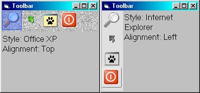



## Internet Explorer and Office XP Toolbar

### Description

Use a better toolbar in your project

Availiable Styles:

- Office XP

- Internet Explorer

Only input is 1 bitmap file with the toolbar icons

Great code to generate the grayscale bitmap in 1 jiffy
 
### More Info
 

             |
---                |---
**Submitted On**   |2003-11-12 18:25:08
**By**             |[Lefteris Eleftheriades](https://github.com/Planet-Source-Code/PSCIndex/blob/master/ByAuthor/lefteris-eleftheriades.md)
**Level**          |Advanced
**User Rating**    |5.0 (25 globes from 5 users)
**Compatibility**  |VB 5\.0, VB 6\.0
**Category**       |[Graphics](https://github.com/Planet-Source-Code/PSCIndex/blob/master/ByCategory/graphics__1-46.md)
**World**          |[Visual Basic](https://github.com/Planet-Source-Code/PSCIndex/blob/master/ByWorld/visual-basic.md)
**Archive File**   |[Internet\_E16713511132003\.zip](https://github.com/Planet-Source-Code/lefteris-eleftheriades-internet-explorer-and-office-xp-toolbar__1-49870/archive/master.zip)

